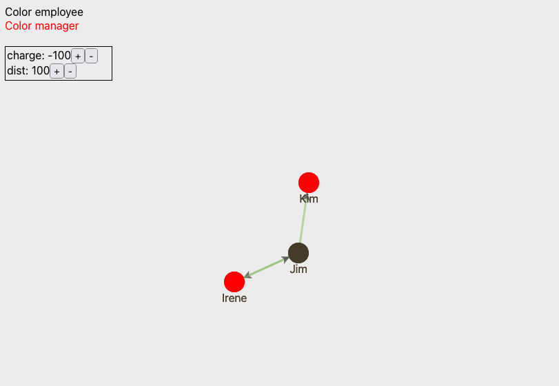

# React Simple D3Force

__React component for d3, implements ForceLayout__

## Install

> npm i react-simple-d3force

## Usage

```js
import { useCallback } from 'react';
import { ForceGraph } from 'react-simple-d3force';
import './App.css';

const nodes = [
  { id: 'Jim', color: 'employee' },
  { id: 'Irene', color: 'manager' },
  { id: 'Kim', color: 'manager' }
];

const edges = [
  { source: 'Jim', target: 'Irene', weight: 3 },
  { source: 'Jim', target: 'Kim', weight: 3 },
  { source: 'Irene', target: 'Jim', weight: 3 },
];

const colors = [
  { label: 'employee', color: '#757393f' },
  { label: 'manager', color: '#ff0000' },
];


<ForceGraph
  style={{ backgroundColor: '#efefe' }}
  width={800}
  height={600}
  nodes={nodes}
  edges={edges}
  colors={colors}
  nodeOnClickHandler={nodeOnClickHandler}
  lineOnClickHandler={lineOnClickHandler}
  displayNodeName={displayNodeName}
  graphModDisplay={(color) => <GraphMod colors={colors} />}
  graphController={(props) => <GraphControl {...props} />}
/>;
```

## GraphModDisplay

```js
function GraphMod({ colors }) {
  return (
    <div>
      {colors.map(({ label, color }) => (
        <div key={color} style={{ color: color }}>{`Color ${label}`}</div>
      ))}
    </div>
  );
}
```


## GraphController

```js
function GraphControl({ charge, setCharge, dist, setDist }) {
  const chargeUphandler = useCallback(
    () => setCharge(v => v - 20),
    [setCharge]
  );
  const chargeDnhandler = useCallback(
    () => setCharge(v => v + 20),
    [setCharge]
  );
  const distUphandler = useCallback(() => setDist(v => v + 20), [setDist]);
  const distDnhandler = useCallback(() => setDist(v => v - 20), [setDist]);

  return (
    <div
      style={{
        position: 'absolute',
        top: 70,
        border: '1px solid',
        padding: 2,
        width: 150,
      }}>
      <div>
        charge: {charge}
        <button onClick={chargeUphandler}>+</button>
        <button onClick={chargeDnhandler}>-</button>
      </div>
      <div>
        dist: {dist}
        <button onClick={distUphandler}>+</button>
        <button onClick={distDnhandler}>-</button>
      </div>
    </div>
  );
}
```



